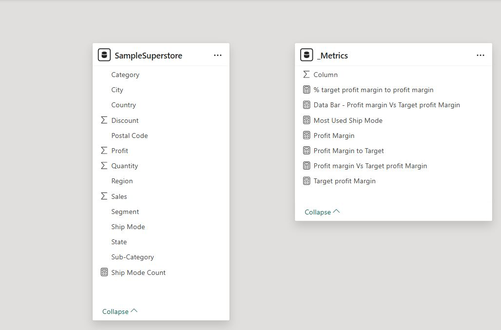
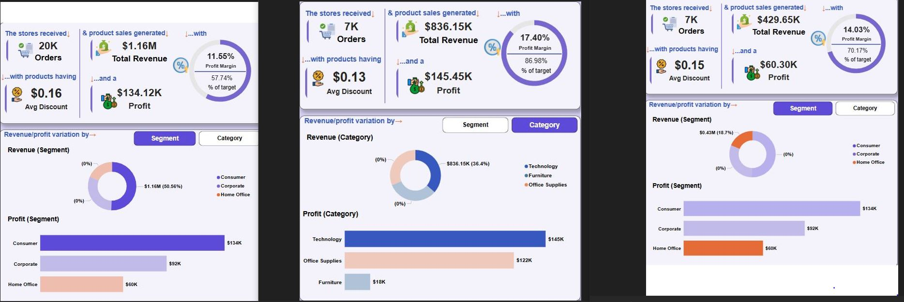
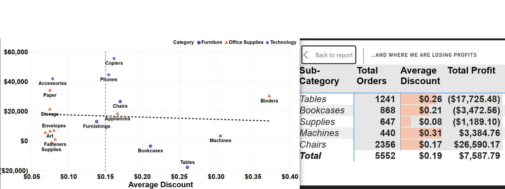
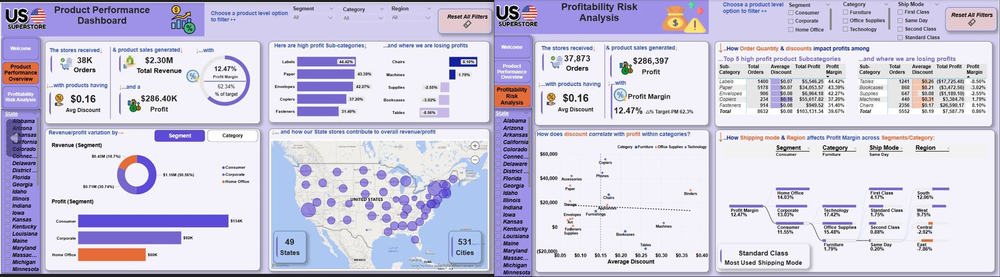

# US Superstore Sales Performance - Exploring Profitability Across Products, Segments & Regions


[Photo Credit](https://create.microsoft.com/en-us/features/ai-image-generator)

## Background
As a Business Manager for a fictitious United States based Superstore, I conducted an Exploratory Data Analysis (EDA) on product performance data to uncover underperforming areas across Regions, market segments, and product categories. The goal was to identify weak areas and provide data-driven recommendations to improve sales, increase profit, and enhance regional strategies.

## Target Audience
This project is designed to provide value to a range of business and data professionals. The insights and visualizations generated are relevant for decision-making, performance monitoring, and strategic planning across various roles:

**1. Business Stakeholders** (Sales Managers, Regional Managers, Product/Category Managers)
- Why it matters: Enables them to identify underperforming products, loss-making states, and profit drivers, guiding actionable improvements in pricing, inventory, and regional sales strategies.

**2. Data & Business Analysts** (Data Analysts, Business Intelligence Analysts, CX Analysts)
- Why it matters: Offers a case study in effective exploratory data analysis, visual storytelling, and deriving business-relevant insights from retail data, valuable for benchmarking and learning.

**3. Executives & Strategy Teams** (C-level Executives (e.g., CRO, COO), Strategic Planners)
- Why it matters: Provides high-level KPIs and performance breakdowns to support strategic decisions on market focus, product investment, and profitability optimization.

**4. Aspiring Data Professionals** (Junior Analysts, Students, Career Switchers)
- Why it matters: Serves as a learning tool for how to conduct and present impactful EDA in a business context, with real-world relevance and dashboard design best practices.

## Business Need Addressed
The insights from this EDA serve strategic, operational, and tactical needs as outlined below:

**1. Assess Overall Business Performance**
- Understand total orders, revenue, profit, and average discounts at a glance.
- Evaluate the geographical spread and volume of operations across 49 states and 531 cities.

**2. Identify High and Low Performing Products**
- Detect top-grossing sub-categories and those consistently generating losses.
- Determine which product categories contribute most to total sales and profit.

**3. Uncover Regional and State-Level Weaknesses**
- Map revenue and profit contribution across US states.
- Pinpoint underperforming states to inform regional sales strategies.

**4. Evaluate Segment and Customer Group Performance**
- Compare revenue and profit by customer segment (Consumer, Corporate, Home Office).
- Identify the most and least profitable segment-product combinations.

**5. Understand the Impact of Discounts and Order Volumes**
- Analyze how average discount levels affect profitability across product categories.
- Flag areas where excessive discounting leads to losses.

**6. Optimize Shipping Mode and Logistics Strategy**
- Assess how shipping mode (e.g., Standard, First Class) affects profit margins.

**7. Support Data-Driven Decision-Making**
- Provide actionable insights to guide pricing, regional targeting, and logistics.
- Empower business managers to optimize strategies for profitability and growth.

 ## Key Questions Answered
1. What are the overall sales and profit figures?
2. Which segments and product categories drive or drag performance?
3. Which states or cities are underperforming or excelling?
4. How do product sub-categories differ in terms of sales and profit?
5. What are the impacts of discounting on profitability?
6. Which shipping modes is most utilised?
7. What is the variance between actual and target profit margins across segments, categories and Regions?
8. What are the most and least profitable products?
9. Where are we losing money despite high order quantity/product movement?
10. How can shipping and pricing strategies be optimized?

## Skills/Concepts applied
-	Cleaning/Validation in Power Query
-	Defining & Computing KPIs
-	Power BI DAX Concepts: Calculated Measures
-	Data Visualization in Power BI
-	Power BI Dashboard building
-	Filters and Slicers
-	Tooltips

## About the Data
The dataset comprises a single table with 9,994 rows and 13 columns, representing detailed product order and sales records from a fictitious U.S.-based Superstore. It includes transactional data across various: **States, Market segments (e.g., Consumer, Corporate, Home Office), Product categories and sub-categories.**
Each record provides insights into key business metrics such as: *Sales and Profit, Quantity and Discount, Region Details, Ship mode.* The dataset was gotten from [The Spark Foundation_GRIP](https://bit.ly/3i4rbWl).  

## Defining Key Performance Indicators (KPIs)
The following metrics were identified as essential Key Performance Indicators (KPIs) to provide the business user with insights into the effectiveness of each campaign, and  Identify opportunities for optimization:

**Provided KPIs (Available in the dataset)**
- Total Orders: Number of units sold per order (Indicates product demand volume by segment or region.)
- Total revenue: Total dollar value of products sold (Tracks gross revenue generation across categories, segments, and states).
- Profit: Net earnings from product sales after cost deductions (Measures business profitability, helping to identify profitable or loss-making areas).
- Discount: The percentage reduction offered on products sold (Helps assess discounting practices and their potential impact on profit margins).
  
**Computed KPIs (Created with DAX Measures in Power BI)**
- Profit Margin (%): Profit as a percentage of sales (Measures efficiency and profitability across products and segments).

These KPIs were used throughout the dashboard to enable interactive exploration and comparison across states, market segments, and product categories — supporting informed business decisions and targeted recommendations.

## Data Transformation/Preprocessing
The dataset was imported into Power BI’s Power Query for data validation and cleaning.  The column profiling was changed from ‘based on Top 1000 rows’ to ‘based on entire dataset’. ‘Column quality’ and ‘Column distribution’ checkboxes were selected to get a summary information about each column for effective cleaning/Preprocessing. The data table was fairly clean and required minimal transformation, which was carried out as follows:
- Column datatypes were validated appropriately - Columns that contain financial data such as the `Sales`,`Profit`, and `Discount` were changed to Currency Type.
- There were no missing values, empty cells or duplicates.
  
## Data Modelling
The dataset was structured as a single flat table, containing all relevant fields needed for analysis. Since there were no relationships to define between multiple tables, there was no need for data modeling into a star or snowflake schema. This structure is shown in the image below:



## Data Exploration (EDA)
With the data now transformed and cleaned, I proceeded to explore it in order to:
- Analyze sales performance, profitability, discount patterns, and order volume across product segments, categories, and geographic locations.
- Provide insights into which product groups and customer segments drive or drain profit.
- Identify opportunities to improve operational efficiency and maximize profitability, addressing the core business need of uncovering weak areas and guiding strategic decisions.

I approached the analysis with a structured, insight-driven workflow focused on uncovering profitability patterns and performance gaps across products, segments, and regions. Specifically, I:
- Aggregated key metrics such as Total Sales, Total Profit, Profit Margin, Order Quantity, and Average Discount to assess performance at various business levels.
- Evaluated profitability trends to identify underperforming product lines and states, with special attention to combinations of high discounts and low or negative profit margins.
- Implemented interactive slicers in Power BI to enable dynamic filtering and drill-down by: Customer Segment, Product Category, State, and Region.

This approach enabled a comprehensive and flexible exploration of the dataset, equipping business users with targeted insights for data-driven decision-making. The metrics were further refined through the creation of the following custom DAX measures in Power BI to enable more dynamic calculations and comparisons.

```
Target profit Margin = 0.20
```
```
% target profit margin to profit margin = 
DIVIDE(DIVIDE(SUM('SampleSuperstore'[Profit]), SUM('SampleSuperstore'[Sales]), 0),
[Target profit Margin])
```
```
Most Used Ship Mode = 
VAR MostUsedMode = 
    TOPN(
        1, 
        SUMMARIZE(
            'SampleSuperstore',
            'SampleSuperstore'[Ship Mode],
            "ShipModeCount", COUNTROWS('SampleSuperstore')
        ),
        [ShipModeCount], 
        DESC
    )
RETURN
    MAXX(MostUsedMode, 'SampleSuperstore'[Ship Mode])
```
```
Profit Margin = DIVIDE(SUM('SampleSuperstore'[Profit]), SUM('SampleSuperstore'[Sales]), 0)
```
```
Profit Margin to Target = 
VAR Targetdiff = [Target profit Margin] - [Profit Margin]
RETURN
IF(Targetdiff<0,0,Targetdiff)
```
Other Measures created to enhance visualization of the metrics:
```
Profit margin Vs Target profit Margin = 
VAR _Value = FORMAT(DIVIDE([Profit Margin],[Target profit Margin]),"0.0%")
VAR _PreText = "△% Target-PM ‎"
VAR _Space = REPT("‎",10)
VAR _Label = 
    _Space & _PreText & _Space & _Value
RETURN
_Label
```
```
Data Bar - Profit margin Vs Target profit Margin = 
VAR _NrIcons_Total = 10
VAR _PctofProfitMargin = DIVIDE([Profit Margin],[Target profit Margin])
VAR _NrIcons_Fill = _PctofProfitMargin * _NrIcons_Total
VAR _NrIcons_Empty = _NrIcons_Total - _NrIcons_Fill

VAR _IconFill = "⬤"
VAR _IconEmpty = "○"

VAR _DataBar =
    REPT(_IconFill, _NrIcons_Fill) &
    REPT(_IconEmpty, _NrIcons_Empty)

    RETURN
    _DataBar
```
With the measures for the metrics computed, it’s time to bring our analysis to life with visuals. 

## KPI Visualization/Presentation
To make the insights easily accessible and actionable, I designed the dashboard using a storytelling approach across two pages:

### Product Performance Overview 
We begin by establishing a baseline understanding of product and sales performance across customer segments, categories, and regions - _**what’s working and where do we stand?**_ 
We observed, from interacting with the visual, that the the highest demand (order quantity) is in the Consumer segment, with the Technology category, generating the highest sales and profit across the business. This reveals a core strength worth reinforcing through marketing and product focus. Interestingly, while the Home-Office segment records the highest profit margin, it receives the fewest orders. This suggests an opportunity to scale, by increasing volume without sacrificing profitability.



### Profitability Risk Analysis
However, this isn’t the full picture. When we shift attention to profitability patterns, to uncover _**where we’re at risk, how discounting strategies impacts performance, and what needs attention**_, it becomes evident that high discount doesn’t always equate to healthy profit margins. Certain product lines, like **Tables and Bookcases,** despite high order quantity, return little to no profit due to deep discounting. This signals potential issues with pricing strategy or over-reliance on promotions.



Together, these insights point to a business that is growing, but not always efficiently. 

## Dashboard:
Having analyzed and visualized the required KPIs, [the interactive dashboard](https://app.powerbi.com/view?r=eyJrIjoiYTdjYzYzZmYtMjMwYS00OTgyLThjMTktZGIwNjA2MGVjOTQxIiwidCI6ImFiMTA0YzYwLTZkZTYtNDc1ZC1hMjBmLTg5M2Y2OWQ2NzlhNCJ9&embedImagePlaceholder=true&pageName=3ab929e1f4888cf87d7b), with Image shown below, was then designed with slicers, tooltips and bookmarks to enable the business user drill down and gain additional insights from the report. A brief video guide of the dashboard can also be accessed through this [link](https://lnkd.in/dyK2JhFX)



## Key Insightss
The dashboard analysis yielded several important business insights:

### High Performers:
- The Consumer Segment and Technology Category had the highest overall revenue and profit contribution.
- The Home Office Segment showed the highest profit margin (14.03%) despite having the lowest order volume.

### Profit Leakage & Risks:
- A significant number of least profitable products, such as Tables and Bookcases were associated with high average discounts.

## Recommendations
Based on the analysis, the following strategic actions are recommended:
- Scale High-Performing Areas: Increase investments in the Consumer segment and Technology category through targeted promotions, bundled offerings, and wider product availability.
- Leverage the Home Office Segment: Though order quantity is lowest, its profitability is highest. Efforts should focus on increasing sales volume while maintaining or improving the profit margin.
- Reevaluate Discounting Strategy: Implement a review process for discount approvals, especially for low-performing product lines where high discounts are hurting profit margins.

## Conclusion
This project provided a data-driven overview of sales and profit performance across a fictitious US-based Superstore’s product segments, categories, and regions. The analysis identified top and bottom performers, profit risks tied to discounting, and under-leveraged segments with strong profit margin potential. With clear visualizations and actionable insights, the dashboard equips business leaders to:
- Make informed product, pricing, and marketing decisions.
- Improve profitability through optimized discounting.
- Align regional strategies based on revenue and profit contribution.
Future analysis opportunities include drilling deeper into customer behavior, time series trends, and integrating supply chain cost data for full profitability analysis.


